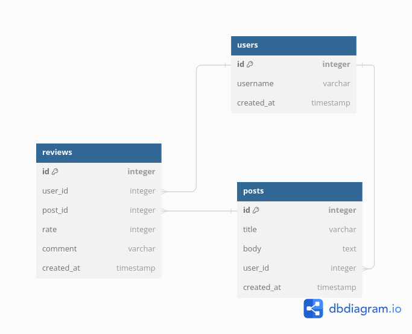

# Social Application

This is a Ruby on Rails application for users to post stories to their timeline and review posts. Users can view their own posts, view other users' timelines, and see top-rated posts based on average review ratings.

## Requirements

- Ruby version: >= 2.5.0
- Rails version: >= 5.2.0
- Database: SQLite

## Setup

1. Clone the repository:
   ```
   git clone <repository_url>
   ```

2. Install dependencies:
   ```
   bundle install
   ```

3. Set up the database:
   ```
   rails db:create
   rails db:migrate
   ```

4. Seed the database:
   ```
   rails db:seed
   ```

## Usage

1. Start the Rails server:
   ```
   rails server
   ```

2. Visit `http://localhost:3000` in your web browser to access the application.

3. Use the provided API endpoints to interact with the application.

## API Endpoints

- Please refer to this postman collection: https://documenter.getpostman.com/view/10320822/2sA3JJ8NGQ

## Testing

Run the test suite to ensure everything is working correctly:
   ```
   rails test
   ```

## Database Schema

The database schema consists of three main tables: `users`, `posts`, and `reviews`. Here's an overview:
   ```
   users:
     - id (primary key)
     - username

   posts:
     - id (primary key)
     - title
     - body
     - user_id (foreign key)

   reviews:
     - id (primary key)
     - rating
     - comment
     - post_id (foreign key)
     - user_id (foreign key)
   ```
  

## Contributing

Contributions are welcome! Feel free to submit bug reports, feature requests, or pull requests.

## License

This project is licensed under the [MIT License](LICENSE).